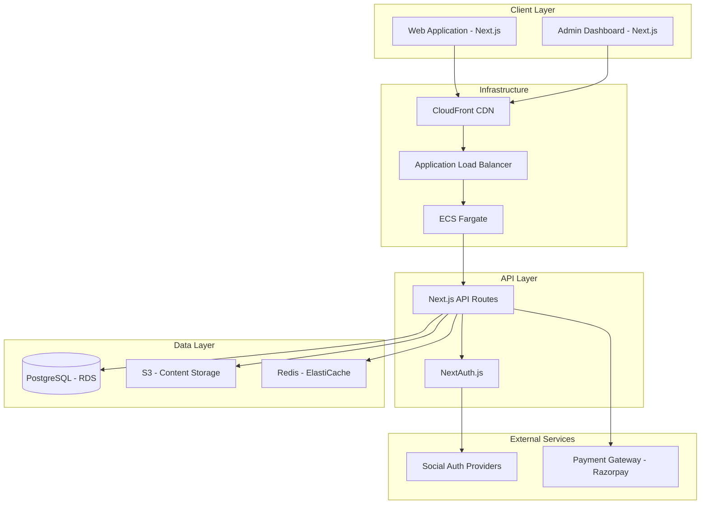

# Design Document

## Overview

The Academy Platform is a modern, scalable learning management system built with Next.js 14+ (App Router), deployed on AWS using CDK for infrastructure as code. The platform follows a microservices-inspired architecture with clear separation between frontend, API, authentication, content management, and payment processing.

The system leverages server-side rendering for optimal SEO and performance, implements secure authentication with social providers, and provides a seamless content consumption experience with progress tracking and subscription management.

## Architecture

### High-Level Architecture



### Technology Stack

**Frontend:**
- Next.js 14+ with App Router
- TypeScript for type safety
- Tailwind CSS for styling
- React Hook Form for form management
- Zustand for client-side state management

**Backend:**
- Next.js API Routes
- NextAuth.js for authentication
- Prisma ORM for database operations
- Zod for schema validation

**Content Processing:**
- gray-matter for frontmatter parsing
- remark for markdown processing
- remark-html for HTML conversion
- rehype plugins for enhanced formatting

**Infrastructure:**
- AWS CDK (TypeScript)
- Amazon ECS Fargate for containerized deployment
- Amazon RDS (PostgreSQL) for structured application data
- Amazon S3 for markdown content files and media storage
- Amazon ElastiCache (Redis) for session caching and performance
- Amazon CloudFront for CDN
- AWS Application Load Balancer

**Payment Integration:**
- Razorpay for Indian market (UPI, bank transfers, cards)
- Webhook handling for payment confirmations

## Components and Interfaces

### Core Components

#### 1. Authentication System
```typescript
interface AuthProvider {
  signIn(provider: 'google' | 'facebook' | 'github'): Promise<SignInResult>
  signOut(): Promise<void>
  getSession(): Promise<Session | null>
}

interface User {
  id: string
  email: string
  name: string
  image?: string
  provider: string
  subscriptionStatus: SubscriptionStatus
  createdAt: Date
  updatedAt: Date
}
```

#### 2. Course Management System
```typescript
interface Course {
  id: string
  title: string
  description: string
  slug: string
  category: string
  difficulty: 'beginner' | 'intermediate' | 'advanced'
  duration: number // in minutes
  price: number
  thumbnailUrl: string
  instructorId: string
  isPublished: boolean
  content: CourseModule[]
  tags: string[]
  createdAt: Date
  updatedAt: Date
}

interface CourseModule {
  id: string
  title: string
  content: string // markdown content
  order: number
  duration: number
  isPreview: boolean
}
```

#### 3. Shopping Cart and Orders
```typescript
interface CartItem {
  courseId: string
  course: Course
  addedAt: Date
}

interface Order {
  id: string
  userId: string
  items: OrderItem[]
  totalAmount: number
  status: 'pending' | 'completed' | 'failed' | 'refunded'
  paymentId?: string
  createdAt: Date
}
```

#### 4. Subscription Management
```typescript
interface Subscription {
  id: string
  userId: string
  plan: 'basic' | 'premium' | 'enterprise'
  status: 'active' | 'cancelled' | 'expired'
  currentPeriodStart: Date
  currentPeriodEnd: Date
  cancelAtPeriodEnd: boolean
}
```

#### 5. Progress Tracking
```typescript
interface UserProgress {
  id: string
  userId: string
  courseId: string
  moduleId: string
  completedAt?: Date
  timeSpent: number // in seconds
  lastAccessedAt: Date
}
```

### API Endpoints

#### Authentication Routes
- `POST /api/auth/signin` - Social media authentication
- `POST /api/auth/signout` - User logout
- `GET /api/auth/session` - Get current session

#### Course Management Routes
- `GET /api/courses` - List courses with filtering
- `GET /api/courses/[slug]` - Get course details
- `POST /api/courses` - Create course (admin only)
- `PUT /api/courses/[id]` - Update course (admin only)
- `DELETE /api/courses/[id]` - Delete course (admin only)

#### User Management Routes
- `GET /api/user/profile` - Get user profile
- `PUT /api/user/profile` - Update user profile
- `GET /api/user/courses` - Get user's purchased courses
- `GET /api/user/progress` - Get learning progress

#### Cart and Orders Routes
- `GET /api/cart` - Get cart contents
- `POST /api/cart/add` - Add item to cart
- `DELETE /api/cart/remove` - Remove item from cart
- `POST /api/orders/create` - Create order
- `GET /api/orders/[id]` - Get order details

#### Payment Routes
- `POST /api/payments/create` - Create payment intent
- `POST /api/payments/webhook` - Handle payment webhooks
- `POST /api/payments/verify` - Verify payment status

#### Subscription Routes
- `GET /api/subscriptions` - Get user subscription
- `POST /api/subscriptions/create` - Create subscription
- `POST /api/subscriptions/cancel` - Cancel subscription

## Data Models

### Database Schema (Prisma)

```prisma
model User {
  id                String         @id @default(cuid())
  email             String         @unique
  name              String
  image             String?
  provider          String
  subscriptionStatus String        @default("none")
  createdAt         DateTime       @default(now())
  updatedAt         DateTime       @updatedAt
  
  orders            Order[]
  progress          UserProgress[]
  subscription      Subscription?
  
  @@map("users")
}

model Course {
  id            String         @id @default(cuid())
  title         String
  description   String
  slug          String         @unique
  category      String
  difficulty    String
  duration      Int
  price         Float
  thumbnailUrl  String
  instructorId  String
  isPublished   Boolean        @default(false)
  tags          String[]
  createdAt     DateTime       @default(now())
  updatedAt     DateTime       @updatedAt
  
  modules       CourseModule[]
  orderItems    OrderItem[]
  progress      UserProgress[]
  
  @@map("courses")
}

model CourseModule {
  id          String         @id @default(cuid())
  title       String
  content     String         // markdown content
  order       Int
  duration    Int
  isPreview   Boolean        @default(false)
  courseId    String
  
  course      Course         @relation(fields: [courseId], references: [id], onDelete: Cascade)
  progress    UserProgress[]
  
  @@map("course_modules")
}
```

### Content Storage Structure

```
s3://academy-content-bucket/
├── courses/
│   ├── {course-id}/
│   │   ├── thumbnail.jpg
│   │   ├── modules/
│   │   │   ├── module-1.md
│   │   │   ├── module-2.md
│   │   │   └── assets/
│   │   │       ├── images/
│   │   │       └── videos/
│   └── ...
└── uploads/
    ├── user-avatars/
    └── temp/
```

## Error Handling

### Error Response Format
```typescript
interface ApiError {
  error: {
    code: string
    message: string
    details?: any
  }
  timestamp: string
  path: string
}
```

### Error Categories
1. **Authentication Errors** (401)
   - Invalid or expired tokens
   - Social auth failures
   
2. **Authorization Errors** (403)
   - Insufficient permissions
   - Subscription required
   
3. **Validation Errors** (400)
   - Invalid input data
   - Missing required fields
   
4. **Payment Errors** (402)
   - Payment processing failures
   - Insufficient funds
   
5. **Server Errors** (500)
   - Database connection issues
   - External service failures

### Error Handling Strategy
- Global error boundary for React components
- API route error middleware
- Structured logging with CloudWatch
- User-friendly error messages
- Automatic retry mechanisms for transient failures

## Testing Strategy

### Unit Testing
- **Framework:** Jest + React Testing Library
- **Coverage:** All utility functions, API routes, and React components
- **Mocking:** Database operations, external APIs, and file system operations

### Integration Testing
- **Database:** Test with actual PostgreSQL instance
- **API Routes:** End-to-end API testing with supertest
- **Authentication:** Test social auth flows with mock providers

### End-to-End Testing
- **Framework:** Playwright
- **Scenarios:**
  - User registration and login flow
  - Course discovery and purchase flow
  - Content consumption and progress tracking
  - Admin content management workflow
  - Payment processing and subscription management

### Performance Testing
- **Load Testing:** Artillery.js for API endpoints
- **Frontend Performance:** Lighthouse CI integration
- **Database Performance:** Query optimization and indexing validation

### Security Testing
- **Authentication:** Test JWT handling and session management
- **Authorization:** Verify access control mechanisms
- **Input Validation:** Test against injection attacks
- **Payment Security:** Validate webhook signature verification

### Testing Environment Setup
```typescript
// jest.config.js
module.exports = {
  testEnvironment: 'jsdom',
  setupFilesAfterEnv: ['<rootDir>/jest.setup.js'],
  moduleNameMapping: {
    '^@/(.*)$': '<rootDir>/src/$1',
  },
  collectCoverageFrom: [
    'src/**/*.{js,jsx,ts,tsx}',
    '!src/**/*.d.ts',
    '!src/pages/api/**',
  ],
}
```

### Continuous Integration
- **GitHub Actions** for automated testing
- **Pre-commit hooks** for code quality
- **Automated deployment** on successful tests
- **Security scanning** with Snyk or similar tools