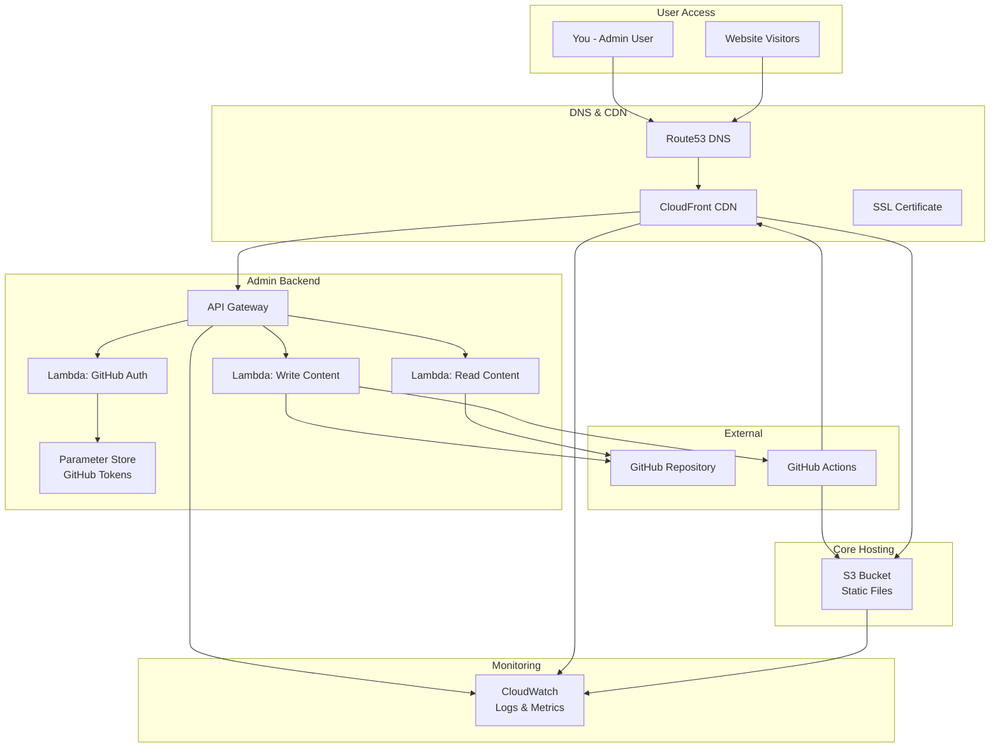
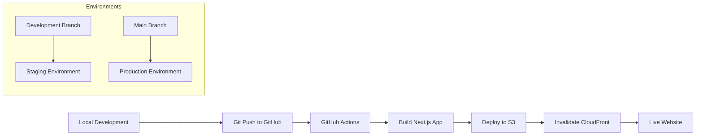
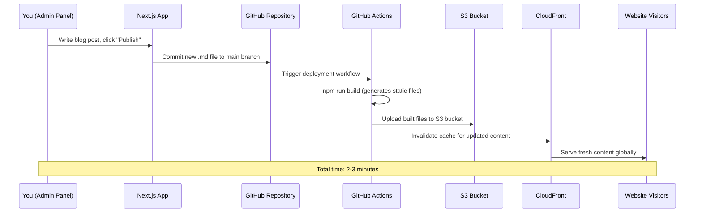
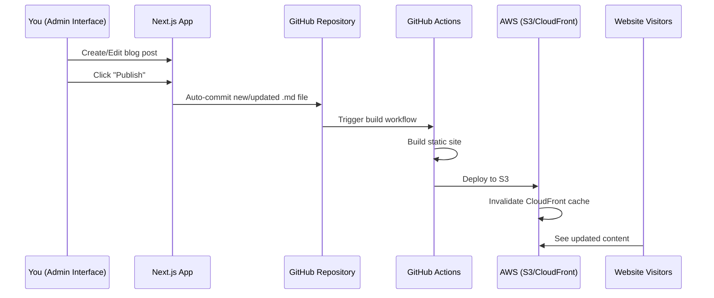
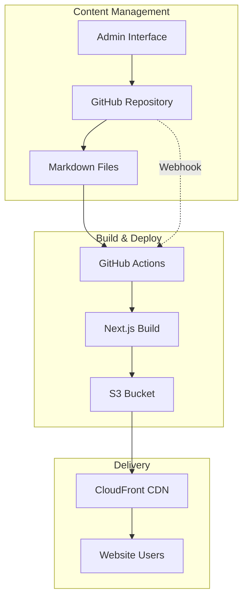
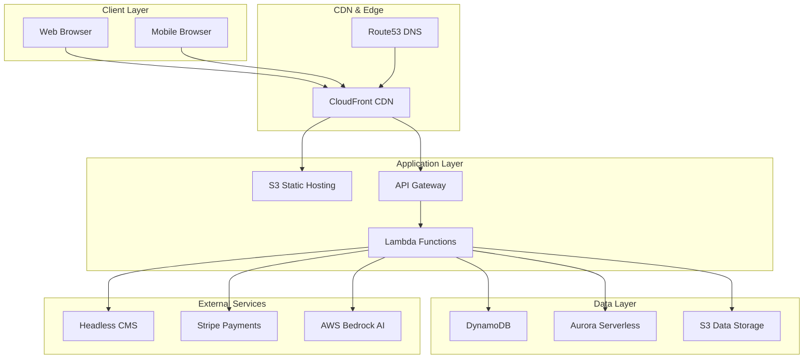

# Design Document

## Overview

The Cloud Nestle website will be built as a modern, scalable, multi-phase platform using AWS services and a headless CMS architecture. The system follows a microservices approach with clear separation between infrastructure, content management, user management, and business logic components.

### Key Design Principles

- **Phased Development**: Incremental delivery starting with MVP and building complexity
- **Scalability**: AWS-native services that scale automatically
- **Security**: Zero-trust architecture with proper authentication and authorization
- **Performance**: CDN-first delivery with optimized static site generation
- **Maintainability**: Infrastructure as Code using AWS CDK with nested stacks
- **Cost Optimization**: Serverless-first approach to minimize operational costs

### CMS Selection: Strapi vs Contentful

**Chosen: Strapi** for the following reasons:

**Cost Comparison:**
- **Strapi**: Completely free (open source), only pay for hosting infrastructure
- **Contentful**: Free tier limited to 25,000 API calls/month, paid plans start at $300/month

**Feature Comparison:**
- **Strapi**: Full admin panel, unlimited content types, user roles, API customization, plugin ecosystem
- **Contentful**: Limited customization on free tier, restricted API calls, fewer admin users

**Ease of Use:**
- **Strapi**: Intuitive admin interface, drag-and-drop content builder, easy content modeling
- **Contentful**: Good UI but limited on free tier, requires technical knowledge for advanced features

**Integration Benefits:**
- **Strapi**: Can be deployed on AWS (ECS/Lambda), direct database control, custom authentication
- **Contentful**: Third-party service, less control over data and infrastructure

**Cost Analysis & Phased Approach:**

**Strapi on AWS Costs (Monthly):**
- ECS Fargate (0.25 vCPU, 0.5GB): ~$15-20/month
- RDS PostgreSQL (db.t3.micro): ~$15-20/month
- **Total: ~$30-40/month**

**Alternative Phased Approach:**

**Phase 1-2 (MVP)**: Use **Markdown + Git-based CMS**
- Store content as Markdown files in GitHub repository
- GitHub Actions automatically trigger builds on content changes
- Next.js builds static site and deploys to S3
- CloudFront serves the updated content
- Simple web-based admin interface for content editing (commits to GitHub)
- **Cost: $0** (only uses existing GitHub + your AWS infrastructure)

**Phase 3+**: Migrate to **Strapi** when revenue justifies cost
- Implement when you have paying customers
- Full CMS features for complex content management
- Multi-user content editing capabilities

**Recommended Strategy:**
1. **Start with Git-based CMS** (Phase 1-2) - Zero additional cost
2. **Upgrade to Strapi** (Phase 3+) - When business model is generating revenue

This approach minimizes initial costs while providing a clear upgrade path.

### Phase 1-2 Git-Based CMS Workflow

#### Content Management Flow

```mermaid
graph LR
    A[Content Creator] --> B[Web Admin Interface]
    B --> C[GitHub Repository]
    C --> D[GitHub Actions]
    D --> E[Next.js Build]
    E --> F[Deploy to S3]
    F --> G[CloudFront CDN]
    G --> H[Website Visitors]
    
    subgraph "Content Storage"
        C1[/content/blog/post1.md]
        C2[/content/services/service1.md]
        C3[/content/pages/about.md]
    end
    
    C --> C1
    C --> C2
    C --> C3
```

#### How You'll Add/Update Content

**Option 1: Simple Web Admin Interface (Recommended)**
```
1. Visit your admin panel at yoursite.com/admin
2. Login with GitHub OAuth
3. Use rich text editor to create/edit blog posts
4. Click "Publish" → automatically commits to GitHub
5. GitHub Actions builds and deploys in 2-3 minutes
6. New content appears on your website
```

**Option 2: Direct GitHub Editing**
```
1. Go to your GitHub repository
2. Navigate to /content/blog/ folder
3. Click "Add file" → "Create new file"
4. Write content in Markdown format
5. Commit changes → auto-deployment triggers
```

**Option 3: Local Development**
```
1. Clone repository to your computer
2. Add new .md files to /content/ folders
3. Git commit and push changes
4. Auto-deployment handles the rest
```

#### Content Structure

**Blog Post Example:**
```markdown
---
title: "How Cloud Migration Reduces IT Costs"
date: "2024-01-15"
category: "Cloud Migration"
tags: ["AWS", "Cost Optimization", "Migration"]
excerpt: "Learn how businesses save 30-50% on IT costs through strategic cloud migration"
author: "Cloud Nestle Team"
featured: true
---

# How Cloud Migration Reduces IT Costs

Your blog content here in Markdown format...

## Key Benefits
- Reduced infrastructure costs
- Improved scalability
- Better security


```

**Service Page Example:**
```markdown
---
title: "AWS Cloud Migration Services"
slug: "aws-cloud-migration"
category: "services"
pricing: "Contact for Quote"
featured: true
---

# AWS Cloud Migration Services

Complete migration services for businesses moving to AWS...

## What's Included
- Assessment and planning
- Migration execution
- Post-migration optimization
```

#### Admin Interface Features

**Custom Admin App (WordPress-like Interface):**

Yes, we'll build a simple admin application that provides a WordPress-like experience:

```typescript
interface AdminInterface {
  // Rich text editor for blog posts (like WordPress editor)
  createBlogPost(): void
  editBlogPost(id: string): void
  
  // Service page management
  createServicePage(): void
  editServicePage(id: string): void
  
  // Media library (like WordPress media) - supports all file types
  uploadImage(file: File): Promise<string>
  uploadDocument(file: File): Promise<string>  // PDFs, Word docs, etc.
  uploadVideo(file: File): Promise<string>     // MP4, WebM, etc.
  browseMediaLibrary(): MediaItem[]
  organizeMediaByType(type: 'image' | 'document' | 'video'): MediaItem[]
  
  // Preview before publish (like WordPress preview)
  previewContent(content: string): void
  
  // One-click publish (commits to GitHub automatically)
  publishContent(content: ContentItem): Promise<void>
  
  // Draft management
  saveDraft(content: ContentItem): Promise<void>
  listDrafts(): ContentItem[]
}
```

**Admin App Features (Similar to WordPress):**
- **Rich Text Editor**: WYSIWYG editor with formatting buttons
- **Complete Media Library**: Upload and manage all file types
  - **Images**: JPG, PNG, WebP, SVG (for blog posts, service pages)
  - **Documents**: PDF, Word, Excel, PowerPoint (for downloads, case studies)
  - **Videos**: MP4, WebM (for service demos, testimonials)
- **Post Management**: List, edit, delete posts like WordPress
- **Draft System**: Save drafts before publishing
- **Preview Mode**: See how content looks before going live
- **File Organization**: Organize media by type, date, or custom folders
- **User-Friendly**: Drag-and-drop uploads, no technical knowledge required

**Two Separate Interfaces:**

**1. Public Website (yoursite.com)**
- What your customers/visitors see
- Blog posts, services, about page, contact
- Professional business website
- Fast, responsive, SEO-optimized

**2. Admin Interface (yoursite.com/admin)**
- WordPress-like CMS for you to manage content
- Password protected - only you can access
- Create/edit blog posts and pages
- Upload images and manage media
- Publish content to the public website

**Technical Implementation:**
- Both interfaces built as one Next.js application
- Public routes: /, /blog, /services, /about, etc.
- Admin routes: /admin, /admin/posts, /admin/media, etc.
- Uses GitHub API to read/write content files
- Rich text editor (like TinyMCE or similar)
- Converts rich text to Markdown automatically
- GitHub OAuth for secure admin login

**Workflow:**
```
You → Login to /admin → Create blog post → Click Publish
                                            ↓
GitHub → Triggers build → Deploys to S3 → Visitors see new post on yoursite.com
```

**Admin Panel Layout (WordPress-style):**
```
┌─────────────────────────────────────┐
│ 🏠 Cloud Nestle Admin    👤 Logout  │
├─────────────────────────────────────┤
│ Dashboard | Posts | Services | Media│
├─────────────────────────────────────┤
│ ┌─────────────────────────────────┐ │
│ │ + Add New Post                  │ │
│ └─────────────────────────────────┘ │
│                                     │
│ All Posts (5)                       │
│ ┌─────────────────────────────────┐ │
│ │ 📝 "Cloud Migration Guide"      │ │
│ │    Draft • Jan 15 • Edit        │ │
│ │    [Edit] [Preview] [Publish]   │ │
│ └─────────────────────────────────┘ │
│ ┌─────────────────────────────────┐ │
│ │ ✅ "AWS Cost Optimization"      │ │
│ │    Published • Jan 10 • 245 views│ │
│ │    [Edit] [View] [Unpublish]    │ │
│ └─────────────────────────────────┘ │
└─────────────────────────────────────┘
```

**Post Editor (WordPress-style):**
```
┌─────────────────────────────────────┐
│ ← Back to Posts                     │
├─────────────────────────────────────┤
│ Title: [How to Migrate to AWS Cloud]│
├─────────────────────────────────────┤
│ [B] [I] [U] [Link] [Image] [List]   │ ← Formatting toolbar
├─────────────────────────────────────┤
│ Content Editor:                     │
│ ┌─────────────────────────────────┐ │
│ │ Cloud migration is becoming...  │ │ ← Rich text editor
│ │                                 │ │
│ │ ## Key Benefits                 │ │
│ │ - Reduced costs                 │ │
│ │ - Better scalability           │ │
│ └─────────────────────────────────┘ │
├─────────────────────────────────────┤
│ Category: [Cloud Migration ▼]      │
│ Tags: [AWS, Migration, Cloud]       │
│ Featured Image: [Upload Image]      │
│ Attachments: [📎 Upload Files]      │
├─────────────────────────────────────┤
│ [Save Draft] [Preview] [Publish]    │
└─────────────────────────────────────┘
```

**Media Library Interface:**
```
┌─────────────────────────────────────┐
│ 📁 Media Library                    │
├─────────────────────────────────────┤
│ [Upload Files] [All] [Images] [Docs] [Videos] │
├─────────────────────────────────────┤
│ ┌───────┐ ┌───────┐ ┌───────┐      │
│ │ 🖼️    │ │ 📄    │ │ 🎥    │      │
│ │image1 │ │guide  │ │demo   │      │
│ │.jpg   │ │.pdf   │ │.mp4   │      │
│ └───────┘ └───────┘ └───────┘      │
│ ┌───────┐ ┌───────┐ ┌───────┐      │
│ │ 🖼️    │ │ 📊    │ │ 🎥    │      │
│ │logo   │ │report │ │intro  │      │
│ │.png   │ │.xlsx  │ │.webm  │      │
│ └───────┘ └───────┘ └───────┘      │
├─────────────────────────────────────┤
│ Selected: demo.mp4                  │
│ Size: 15.2 MB • Uploaded: Jan 15   │
│ [Copy Link] [Insert] [Delete]       │
└─────────────────────────────────────┘
```

#### Deployment Pipeline

**GitHub Actions Workflow:**
```yaml
name: Deploy Website
on:
  push:
    branches: [main]
    paths: ['content/**', 'src/**']

jobs:
  deploy:
    runs-on: ubuntu-latest
    steps:
      - name: Checkout code
        uses: actions/checkout@v3
      
      - name: Setup Node.js
        uses: actions/setup-node@v3
        with:
          node-version: '18'
      
      - name: Install dependencies
        run: npm ci
      
      - name: Build static site
        run: npm run build
        
      - name: Deploy to S3
        run: aws s3 sync ./out s3://your-bucket-name --delete
        
      - name: Invalidate CloudFront
        run: aws cloudfront create-invalidation --distribution-id YOUR_DIST_ID --paths "/*"
```

#### Content Organization

**Repository Structure:**
```
your-website/
├── content/
│   ├── blog/
│   │   ├── 2024-01-15-cloud-migration-costs.md
│   │   ├── 2024-01-20-aws-security-best-practices.md
│   │   └── images/
│   │       ├── cost-comparison.png
│   │       └── security-diagram.jpg
│   ├── services/
│   │   ├── aws-migration.md
│   │   ├── cloud-consulting.md
│   │   └── managed-services.md
│   └── pages/
│       ├── about.md
│       ├── contact.md
│       └── privacy-policy.md
├── src/
│   ├── components/
│   ├── pages/
│   └── admin/
└── public/
    └── images/
```

#### Benefits of This Approach

**For You (Content Creator):**
- Simple web interface - no technical knowledge needed
- Write in familiar rich text editor
- Preview before publishing
- Version control - never lose content
- Work offline and sync later

**For Development:**
- Zero additional hosting costs
- Automatic backups (Git history)
- Easy to migrate to full CMS later
- Fast website performance (static files)
- Secure (no database to hack)

**Content Workflow Example:**
```
Monday: Write blog post in admin interface (5 minutes)
        → Click publish → Auto-deploys in 3 minutes
        → Blog post live on website

Tuesday: Update service pricing in services page
         → Edit existing page → Save changes
         → Auto-deploys → Updated pricing live

Wednesday: Add new case study with images
           → Upload images via admin panel
           → Write case study content
           → Publish → Live in minutes
```

This gives you a professional content management experience without the ongoing costs of a traditional CMS, while keeping the door open to upgrade to Strapi when your business grows.

### MVP (Phase 1-2) Feature List

**What Will Be Implemented:**

**Public Website Features:**
- ✅ Professional homepage with company branding
- ✅ Services pages (AWS Migration, Cloud Consulting, etc.)
- ✅ Blog section with categorized posts
- ✅ About page and contact information
- ✅ Mobile-responsive design
- ✅ SEO optimization (meta tags, sitemap)
- ✅ Fast loading with CloudFront CDN
- ✅ SSL certificate and custom domain

**Admin Interface Features:**
- ✅ WordPress-like dashboard (/admin)
- ✅ Rich text editor for blog posts
- ✅ Service page management
- ✅ Media library (upload images, PDFs, videos)
- ✅ Draft and publish system
- ✅ Preview before publishing
- ✅ GitHub OAuth login (secure access)
- ✅ File organization and management

**Technical Features:**
- ✅ AWS infrastructure (S3, CloudFront, Route53)
- ✅ Automatic deployment pipeline
- ✅ GitHub integration (auto-commit from admin)
- ✅ CDK infrastructure as code
- ✅ CloudWatch monitoring and logging
- ✅ Backup and version control via Git

**What Will NOT Be in MVP (Coming in Later Phases):**

**Phase 3 Features (Missing from MVP):**
- ❌ User registration and login system
- ❌ User dashboards and profiles
- ❌ Content access control (free vs premium)
- ❌ User role management

**Phase 4 Features (Missing from MVP):**
- ❌ Subscription/payment system (Stripe integration)
- ❌ Partner and distributor portals
- ❌ Affiliate marketing system
- ❌ Commission tracking
- ❌ Freemium content model

**Phase 5 Features (Missing from MVP):**
- ❌ Industry-specific landing pages
- ❌ SMB-focused content sections
- ❌ Advanced content categorization by industry

**Phase 6 Features (Missing from MVP):**
- ❌ AI chatbot with RAG integration
- ❌ Knowledge base for AI responses
- ❌ Conversation history and analytics

**Phase 7 Features (Missing from MVP):**
- ❌ Marketplace platform
- ❌ Product catalog system
- ❌ Multi-vendor support
- ❌ Order management system

**Advanced Features Missing from MVP:**
- ❌ Advanced analytics and user tracking
- ❌ Email marketing integration
- ❌ Lead capture forms with CRM integration
- ❌ Multi-language support
- ❌ Advanced SEO features (schema markup, etc.)
- ❌ Social media integration
- ❌ Newsletter subscription system
- ❌ Comment system for blog posts
- ❌ Search functionality
- ❌ Content scheduling (publish at specific times)

**MVP Focus:**
The MVP focuses on getting your business online with a professional presence and easy content management. All the advanced business features (payments, user accounts, AI, marketplace) come in later phases once you validate the market and start generating revenue.

### Migration Strategy: When Do You Need Headless CMS?

**Git-Based CMS is Sufficient For:**
- ✅ Phase 1-2: Basic website with blog and services
- ✅ Simple content management (you as the only editor)
- ✅ Static content that doesn't require user accounts
- ✅ Basic business website functionality

**You MUST Migrate to Headless CMS (Strapi) When:**
- 🔄 **Phase 3**: Adding user accounts and authentication
- 🔄 **Phase 4**: Implementing subscription/payment system
- 🔄 **Phase 4**: Creating partner/distributor portals
- 🔄 **Phase 6**: Adding AI chatbot (needs dynamic content)

**Why Migration is Required:**

**Git-Based Limitations:**
- Cannot handle user-specific content
- No real-time data updates
- No user authentication integration
- No dynamic content based on user roles
- No API for external integrations

**Headless CMS Benefits for Advanced Features:**
- User-specific content delivery
- Real-time updates for dashboards
- API endpoints for mobile apps
- Integration with payment systems
- Multi-user content editing
- Content access control by user role

**Migration Timeline & Cost:**
- **Phase 1-2**: Git-based CMS ($0 additional costs)
- **Phase 3 Migration**: Switch to Strapi (~$30-40/month)
- **Migration Time**: 1-2 weeks development
- **Downtime**: Minimal (smooth content transfer)

**The Good News:**
Your admin interface and content will largely stay the same. Migration mainly involves moving content from files to database and adding user features.

**Recommendation:**
Start with Git-based CMS to save money and validate your business, then migrate to Strapi when you need user accounts and paid features.

### AWS Infrastructure Breakdown

#### Public Website Infrastructure

**Core Services:**
- **S3 Bucket**: Hosts static website files (HTML, CSS, JS, images)
  - Bucket name: `cloudnestle-website-prod`
  - Static website hosting enabled
  - Public read access for website files
  - Estimated cost: ~$1-5/month (depending on traffic)

- **CloudFront CDN**: Global content delivery network
  - Caches website content worldwide
  - SSL/TLS termination
  - Custom domain support (cloudnestle.com)
  - Estimated cost: ~$1-10/month (depending on traffic)

- **Route53**: DNS management
  - Domain registration and DNS hosting
  - A/AAAA records pointing to CloudFront
  - Health checks and routing
  - Estimated cost: ~$0.50/month + domain registration

- **ACM (Certificate Manager)**: SSL certificates
  - Free SSL certificate for cloudnestle.com
  - Automatic renewal
  - Cost: $0 (free)

- **CloudWatch**: Monitoring and logging
  - Website performance metrics
  - Error logging and alerts
  - Estimated cost: ~$1-3/month

**Total Website Infrastructure Cost: ~$3-20/month**

#### Admin Panel Infrastructure

**The admin panel uses the SAME infrastructure as the website:**

- **Same S3 Bucket**: Admin interface is part of the same Next.js app
  - Admin routes: `/admin/*` served from same bucket
  - No additional S3 costs

- **Same CloudFront**: Admin panel served through same CDN
  - Protected routes with authentication
  - No additional CloudFront costs

- **GitHub Integration Services:**
  - **Lambda Functions**: Handle GitHub API calls
    - Function 1: Authenticate with GitHub OAuth
    - Function 2: Read content from repository
    - Function 3: Commit changes to repository
    - Function 4: Trigger builds
    - Estimated cost: ~$0-2/month (very low usage)

  - **API Gateway**: REST API for admin functions
    - Endpoints for GitHub operations
    - Authentication and authorization
    - Estimated cost: ~$0-1/month

  - **Systems Manager Parameter Store**: Store GitHub tokens securely
    - OAuth tokens and API keys
    - Cost: $0 (free tier sufficient)

**Total Admin Panel Additional Cost: ~$0-3/month**

#### Deployment Infrastructure

**GitHub Actions**: Build and deployment (runs on GitHub, not AWS)
- Builds Next.js application
- Deploys to S3
- Invalidates CloudFront cache
- Cost: $0 (GitHub Actions free tier)

**AWS CLI/SDK**: Used by GitHub Actions
- No additional cost (just API calls)

#### Complete Infrastructure Diagram



#### Cost Summary

**Monthly AWS Costs:**
- **Website Infrastructure**: $3-20/month
- **Admin Panel Additional**: $0-3/month
- **Total**: $3-23/month

**One-time Costs:**
- Domain registration: ~$12/year
- Development setup: One-time effort

**What's NOT Included (Saves Money):**
- No EC2 instances (serverless approach)
- No RDS database (using GitHub as storage)
- No ECS/EKS containers (static hosting)
- No Load Balancers (CloudFront handles this)
- No NAT Gateways (no VPC needed)

**Scaling:**
- Automatically scales with traffic
- Pay only for what you use
- No fixed server costs
- Can handle traffic spikes without additional setup

#### Database Requirements by Phase

**Phase 1-2 (MVP) - NO DATABASE NEEDED:**
- ❌ No DynamoDB
- ❌ No Aurora  
- ❌ No RDS
- ✅ Content stored as files in GitHub repository
- ✅ Zero database costs

**Phase 3+ - Database Required:**
- ✅ DynamoDB for user accounts, subscriptions
- ✅ Aurora Serverless for complex queries (optional)
- 💰 Additional cost: ~$5-20/month

**Why No Database in MVP:**
- **Content Management**: GitHub stores all content as Markdown files
- **No User Accounts**: No need to store user data
- **No Dynamic Data**: Everything is static content
- **Cost Savings**: Eliminates database hosting costs
- **Simplicity**: Fewer moving parts, easier to manage

**When You'll Need Databases:**
- **Phase 3**: User registration → Need DynamoDB for user profiles
- **Phase 4**: Subscriptions → Need to store payment data
- **Phase 6**: AI Chatbot → Need to store conversation history
- **Phase 7**: Marketplace → Need product and order data

**MVP Data Storage:**
```
GitHub Repository Structure:
├── content/
│   ├── blog/
│   │   ├── post1.md          ← Blog posts
│   │   └── post2.md
│   ├── services/
│   │   ├── aws-migration.md  ← Service pages
│   │   └── consulting.md
│   └── pages/
│       ├── about.md          ← Static pages
│       └── contact.md
└── public/
    └── images/               ← Media files
```

**Result: No Database = Lower Costs + Simpler Architecture**

### Deployment Strategy

#### Development Workflow



#### Multi-Environment Setup

**1. Development Environment**
- **Branch**: `develop`
- **Domain**: `dev.cloudnestle.com`
- **S3 Bucket**: `cloudnestle-website-dev`
- **CloudFront**: Separate distribution
- **Purpose**: Testing new features before production

**2. Production Environment**
- **Branch**: `main`
- **Domain**: `cloudnestle.com`
- **S3 Bucket**: `cloudnestle-website-prod`
- **CloudFront**: Production distribution
- **Purpose**: Live website for customers

#### GitHub Actions Deployment Pipeline

**Automatic Deployment Triggers:**
```yaml
# .github/workflows/deploy.yml
name: Deploy Website

on:
  push:
    branches: 
      - main        # Deploys to production
      - develop     # Deploys to staging
  pull_request:
    branches: [main] # Runs tests only

jobs:
  deploy:
    runs-on: ubuntu-latest
    steps:
      # 1. Checkout code
      - name: Checkout
        uses: actions/checkout@v3
      
      # 2. Setup Node.js
      - name: Setup Node.js
        uses: actions/setup-node@v3
        with:
          node-version: '18'
          cache: 'npm'
      
      # 3. Install dependencies
      - name: Install dependencies
        run: npm ci
      
      # 4. Run tests
      - name: Run tests
        run: npm run test
      
      # 5. Build application
      - name: Build Next.js app
        run: npm run build
        env:
          NEXT_PUBLIC_ENVIRONMENT: ${{ github.ref == 'refs/heads/main' && 'production' || 'development' }}
      
      # 6. Deploy to appropriate environment
      - name: Deploy to S3
        run: |
          if [ "${{ github.ref }}" = "refs/heads/main" ]; then
            aws s3 sync ./out s3://cloudnestle-website-prod --delete
            aws cloudfront create-invalidation --distribution-id ${{ secrets.PROD_CLOUDFRONT_ID }} --paths "/*"
          else
            aws s3 sync ./out s3://cloudnestle-website-dev --delete
            aws cloudfront create-invalidation --distribution-id ${{ secrets.DEV_CLOUDFRONT_ID }} --paths "/*"
          fi
        env:
          AWS_ACCESS_KEY_ID: ${{ secrets.AWS_ACCESS_KEY_ID }}
          AWS_SECRET_ACCESS_KEY: ${{ secrets.AWS_SECRET_ACCESS_KEY }}
          AWS_DEFAULT_REGION: us-east-1
```

#### Content Deployment Flow

**When You Publish Content in Admin:**


#### Infrastructure Deployment (CDK)

**Initial Setup:**
```bash
# 1. Clone repository
git clone https://github.com/your-username/cloudnestle-website
cd cloudnestle-website

# 2. Install dependencies
npm install

# 3. Configure AWS credentials
aws configure

# 4. Deploy infrastructure
npm run deploy:infrastructure

# 5. Deploy website
npm run deploy:website
```

**CDK Deployment Commands:**
```typescript
// package.json scripts
{
  "scripts": {
    "build": "next build && next export",
    "deploy:infrastructure": "cdk deploy --all",
    "deploy:website": "npm run build && aws s3 sync ./out s3://cloudnestle-website-prod",
    "deploy:dev": "npm run build && aws s3 sync ./out s3://cloudnestle-website-dev"
  }
}
```

#### Rollback Strategy

**Automatic Rollback:**
- If build fails, previous version remains live
- GitHub Actions stops deployment on test failures
- CloudFront continues serving cached content

**Manual Rollback:**
```bash
# Rollback to previous commit
git revert HEAD
git push origin main

# Or rollback to specific version
git reset --hard <commit-hash>
git push --force origin main
```

**Emergency Rollback:**
- Revert S3 bucket to previous version
- Use S3 versioning to restore files
- CloudFront cache invalidation

#### Monitoring and Alerts

**Deployment Monitoring:**
- GitHub Actions notifications on build failures
- CloudWatch alarms for website availability
- Email alerts for deployment issues

**Health Checks:**
```yaml
# Health check after deployment
- name: Verify deployment
  run: |
    curl -f https://cloudnestle.com || exit 1
    curl -f https://cloudnestle.com/admin || exit 1
```

#### Security in Deployment

**Secrets Management:**
- AWS credentials stored in GitHub Secrets
- Environment variables for different stages
- No sensitive data in repository

**Access Control:**
- GitHub repository access controls
- AWS IAM roles with minimal permissions
- Branch protection rules for main branch

#### Deployment Timeline

**Initial Setup (One-time):**
- Infrastructure deployment: 10-15 minutes
- DNS propagation: 24-48 hours
- SSL certificate validation: 5-10 minutes

**Regular Content Updates:**
- Content creation: 5-10 minutes
- Automatic deployment: 2-3 minutes
- Global CDN propagation: 1-2 minutes
- **Total**: 8-15 minutes from writing to live

**Code Updates:**
- Development and testing: Variable
- Deployment to staging: 2-3 minutes
- Testing on staging: Variable
- Deployment to production: 2-3 minutes

This deployment strategy ensures reliable, fast, and secure updates to your website with minimal manual intervention.

### GitHub Auto-Commit Process

**Yes, changes in the admin interface automatically push to GitHub:**



**Step-by-Step Process:**
1. **You write a blog post** in the admin interface
2. **Click "Publish"** → App converts rich text to Markdown
3. **Auto-commit to GitHub** → Creates/updates .md file in repository
4. **GitHub Actions triggers** → Builds the static website
5. **Deploys to S3** → Updates your live website
6. **CloudFront cache cleared** → Visitors see new content immediately

**Technical Implementation:**
```typescript
// When you click "Publish" in admin interface
async function publishPost(postData: BlogPost) {
  // 1. Convert rich text to Markdown
  const markdownContent = convertToMarkdown(postData.content)
  
  // 2. Create file content with frontmatter
  const fileContent = `---
title: "${postData.title}"
date: "${postData.date}"
category: "${postData.category}"
---

${markdownContent}`
  
  // 3. Auto-commit to GitHub
  await githubAPI.createOrUpdateFile({
    path: `content/blog/${postData.slug}.md`,
    content: fileContent,
    message: `Add/Update blog post: ${postData.title}`
  })
  
  // 4. GitHub Actions automatically handles the rest
}
```

**Benefits:**
- **Zero manual work** - Everything happens automatically
- **Version control** - Every change is tracked in Git
- **Rollback capability** - Can revert any change if needed
- **Backup** - Your content is safely stored in GitHub
- **Collaboration ready** - Easy to add team members later

**Timeline:**
- Write post in admin: 5 minutes
- Click publish: Instant
- Auto-deployment: 2-3 minutes
- Content live on website: Total ~3-5 minutes

### Phase 1-2 (MVP) Detailed Workflow

#### Git-Based CMS Architecture



#### Content Management Workflow

**1. Content Creation/Editing:**
```
Content Editor → Admin Interface → GitHub Commit → Automatic Deployment
```

**2. File Structure:**
```
/content
  /pages
    - home.md
    - about.md
    - services.md
  /blog
    - 2024-01-15-cloud-migration.md
    - 2024-01-20-aws-best-practices.md
  /services
    - cloud-consulting.md
    - infrastructure-setup.md
  /config
    - navigation.json
    - site-settings.json
```

**3. Markdown File Format:**
```markdown
---
title: "Cloud Migration Services"
description: "Professional cloud migration consulting"
category: "services"
industry: "technology"
accessLevel: "free"
publishedAt: "2024-01-15"
tags: ["cloud", "migration", "aws"]
seo:
  metaTitle: "Cloud Migration Services | Cloud Nestle"
  metaDescription: "Expert cloud migration services..."
---

# Cloud Migration Services

Your content here in Markdown format...

## Key Benefits
- Reduced infrastructure costs
- Improved scalability
- Enhanced security
```

#### Admin Interface Features

**Simple Web-Based Editor:**
```typescript
interface AdminInterface {
  // Content management
  listContent(): ContentItem[]
  editContent(id: string): void
  createContent(type: ContentType): void
  deleteContent(id: string): void
  
  // GitHub integration
  commitChanges(message: string): Promise<void>
  previewChanges(): void
  
  // Site management
  updateNavigation(): void
  manageSiteSettings(): void
}

interface ContentItem {
  id: string
  title: string
  type: 'page' | 'blog' | 'service'
  status: 'draft' | 'published'
  lastModified: Date
  path: string
}
```

**Admin Interface Pages:**
1. **Dashboard**: Overview of content, recent changes
2. **Content List**: All pages/posts with edit/delete actions
3. **Content Editor**: Markdown editor with live preview
4. **Site Settings**: Navigation, SEO settings, site configuration
5. **Preview**: See changes before publishing

#### Deployment Pipeline

**GitHub Actions Workflow:**
```yaml
name: Deploy Website

on:
  push:
    branches: [main]
    paths: ['content/**', 'src/**']

jobs:
  deploy:
    runs-on: ubuntu-latest
    steps:
      - name: Checkout
        uses: actions/checkout@v3
      
      - name: Setup Node.js
        uses: actions/setup-node@v3
        with:
          node-version: '18'
      
      - name: Install dependencies
        run: npm ci
      
      - name: Build Next.js site
        run: npm run build
        env:
          NEXT_PUBLIC_SITE_URL: ${{ secrets.SITE_URL }}
      
      - name: Deploy to S3
        run: aws s3 sync ./out s3://${{ secrets.S3_BUCKET }} --delete
        env:
          AWS_ACCESS_KEY_ID: ${{ secrets.AWS_ACCESS_KEY_ID }}
          AWS_SECRET_ACCESS_KEY: ${{ secrets.AWS_SECRET_ACCESS_KEY }}
      
      - name: Invalidate CloudFront
        run: |
          aws cloudfront create-invalidation \
            --distribution-id ${{ secrets.CLOUDFRONT_DISTRIBUTION_ID }} \
            --paths "/*"
```

#### Content Loading in Next.js

**Static Generation with Markdown:**
```typescript
// lib/content.ts
import fs from 'fs'
import path from 'path'
import matter from 'gray-matter'

export interface ContentItem {
  slug: string
  title: string
  content: string
  metadata: ContentMetadata
}

export function getAllContent(type: 'pages' | 'blog' | 'services'): ContentItem[] {
  const contentDir = path.join(process.cwd(), 'content', type)
  const filenames = fs.readdirSync(contentDir)
  
  return filenames
    .filter(name => name.endsWith('.md'))
    .map(filename => {
      const filePath = path.join(contentDir, filename)
      const fileContents = fs.readFileSync(filePath, 'utf8')
      const { data, content } = matter(fileContents)
      
      return {
        slug: filename.replace('.md', ''),
        title: data.title,
        content,
        metadata: data
      }
    })
    .sort((a, b) => new Date(b.metadata.publishedAt).getTime() - new Date(a.metadata.publishedAt).getTime())
}

// pages/[...slug].tsx - Dynamic routing for all content
export async function getStaticPaths() {
  const pages = getAllContent('pages')
  const blog = getAllContent('blog')
  const services = getAllContent('services')
  
  const paths = [
    ...pages.map(item => ({ params: { slug: [item.slug] } })),
    ...blog.map(item => ({ params: { slug: ['blog', item.slug] } })),
    ...services.map(item => ({ params: { slug: ['services', item.slug] } }))
  ]
  
  return { paths, fallback: false }
}

export async function getStaticProps({ params }) {
  // Load content based on slug
  const content = getContentBySlug(params.slug)
  return { props: { content } }
}
```

#### Development Workflow

**Daily Content Management:**
1. **Content Editor** logs into admin interface
2. **Edits content** using markdown editor with live preview
3. **Commits changes** with descriptive message
4. **GitHub Actions** automatically builds and deploys (5-10 minutes)
5. **CloudFront** serves updated content globally

**Technical Workflow:**
1. **Developer** makes code changes locally
2. **Pushes to GitHub** main branch
3. **Same pipeline** builds and deploys automatically
4. **Content and code** deploy together seamlessly

#### Benefits of This Approach

**Cost Benefits:**
- **$0 additional monthly costs** beyond your AWS infrastructure
- No CMS hosting fees
- No database costs for content storage

**Technical Benefits:**
- **Version control** for all content changes
- **Automatic backups** via Git history
- **Fast performance** with static site generation
- **Simple deployment** pipeline

**Content Management Benefits:**
- **Easy editing** with markdown and web interface
- **Preview before publish** capability
- **Collaborative editing** with Git workflow
- **SEO-friendly** with full control over metadata

**Scalability:**
- **Handles high traffic** with CloudFront CDN
- **Fast global delivery** of static content
- **Easy to migrate** to Strapi later when needed

### Technology Stack

- **Frontend**: Next.js with TypeScript for static site generation and dynamic features
- **UI Framework**: Tailwind CSS with Headless UI components for responsive design
- **Design System**: Custom component library with consistent branding
- **Backend**: AWS Lambda functions with Node.js/TypeScript
- **Database**: None for MVP (Phase 1-2), DynamoDB for user data in Phase 3+
- **CMS**: Git-based (Phase 1-2) → Strapi (Phase 3+) for cost optimization
- **Infrastructure**: AWS CDK with TypeScript for Infrastructure as Code
- **Authentication**: AWS Cognito for user management
- **Payments**: Stripe integration for subscription management
- **AI/ML**: AWS Bedrock for RAG chatbot functionality

## Architecture

### High-Level Architecture



### Phase-Based Architecture Evolution

**Phase 1 (MVP)**: Static site with basic infrastructure
- S3 + CloudFront + Route53
- Basic Next.js site with static content
- SSL/TLS with ACM

**Phase 2**: Add CMS and dynamic content
- Integrate headless CMS
- Add build pipeline for content updates
- CloudWatch monitoring

**Phase 3**: User management and authentication
- AWS Cognito integration
- User portals and dashboards
- DynamoDB for user data

**Phase 4**: Business model implementation
- Stripe payment integration
- Subscription management
- Partner/affiliate tracking

**Phase 5**: Industry solutions
- Enhanced content categorization
- Industry-specific landing pages
- Advanced analytics

**Phase 6**: AI integration
- AWS Bedrock for chatbot
- Vector database for RAG
- Knowledge base management

**Phase 7**: Marketplace platform
- Product catalog system
- Order management
- Multi-vendor support

## UI/UX Design

### Design System and Branding

#### Visual Identity (To Be Refined with Competitor Analysis)

**Refined Design Based on Competitor Analysis:**

**Analyzed Competitors:**
- Operisoft.com (AWS Advanced Partner)
- CloudThat.com (Training + Consulting)
- CloudWorkmates.com (Premier Partner)
- JetSweep.co (Advanced Partner)

**Key Industry Insights:**

**Color Schemes (Industry Standard):**
- **Primary**: Deep blue (#1E3A8A) or navy (#1E293B) - conveys trust and professionalism
- **Accent**: Orange (#F97316) or green (#10B981) - for CTAs and highlights
- **Background**: Clean whites (#FFFFFF) with subtle grays (#F8FAFC)
- **Text**: Dark grays (#374151) for readability

**Typography Patterns:**
- **Headers**: Bold, sans-serif fonts (Inter, Poppins, or Roboto)
- **Body**: Clean, readable fonts with good line spacing
- **Size hierarchy**: Large hero text, clear section headers

**Layout Patterns Observed:**

**Homepage Structure:**
1. **Hero Section**: Bold headline + value proposition + primary CTA
2. **Services Grid**: 3-4 column layout with icons
3. **Trust Indicators**: AWS certifications, partner badges
4. **Case Studies/Testimonials**: Social proof section
5. **Secondary CTA**: "Get Free Consultation" or "Contact Us"

**Navigation Patterns:**
- **Services dropdown**: Detailed service categories
- **About/Company**: Leadership, certifications
- **Resources**: Blog, case studies, whitepapers
- **Contact**: Prominent contact information

**Trust Building Elements:**
- AWS Partner badges prominently displayed
- Certification logos (AWS competencies)
- Client testimonials with company names
- Case study previews
- "Free consultation" offers

**Content Presentation:**
- **Service pages**: Problem → Solution → Benefits → CTA
- **Technical depth**: Detailed service descriptions
- **Industry focus**: SMB and enterprise solutions
- **Clear pricing**: "Contact for quote" or consultation offers

**Mobile-First Design:**
- Hamburger menus for mobile
- Touch-friendly buttons
- Responsive service grids
- Optimized contact forms

**Updated Visual Identity:**
- **Primary Colors**: Navy blue (#1E293B), AWS orange (#FF9900)
- **Secondary Colors**: Light grays (#F8FAFC, #E5E7EB), dark text (#374151)
- **Typography**: Inter for headers, system fonts for body
- **Iconography**: Professional service icons, AWS-style graphics
- **Photography**: Professional team photos, office environments

**Competitive Advantages to Highlight:**
- AWS partnership status
- Industry certifications
- Free consultation offers
- SMB focus (like CloudWorkmates)
- Technical expertise depth
- Cost optimization focus

#### Design Principles
- **Professional**: Clean, corporate aesthetic suitable for B2B clients
- **Trustworthy**: Clear information hierarchy and transparent pricing
- **Accessible**: WCAG 2.1 AA compliance for inclusive design
- **Mobile-First**: Responsive design optimized for all devices
- **Performance**: Optimized images and minimal JavaScript for fast loading

### User Experience Flow

#### Homepage Experience
```
Landing → Value Proposition → Services Overview → Industry Solutions → CTA
```

#### User Journey Mapping
1. **Anonymous Visitor**: Browse services → View case studies → Contact/Subscribe
2. **Free User**: Login → Access free content → Upgrade prompts → Premium conversion
3. **Premium User**: Login → Full content access → Partner opportunities
4. **Partner/Distributor**: Login → Dashboard → Resources → Commission tracking

### Page Layouts and Components

#### Homepage Layout
```
┌─────────────────────────────────────┐
│ Header (Logo, Navigation, Login)    │
├─────────────────────────────────────┤
│ Hero Section (Value Prop + CTA)     │
├─────────────────────────────────────┤
│ Services Overview (3-column grid)   │
├─────────────────────────────────────┤
│ Industry Solutions (carousel)       │
├─────────────────────────────────────┤
│ Client Testimonials                 │
├─────────────────────────────────────┤
│ Partner Program CTA                 │
├─────────────────────────────────────┤
│ Footer (Links, Contact, Social)     │
└─────────────────────────────────────┘
```

#### Service Pages Layout
```
┌─────────────────────────────────────┐
│ Breadcrumb Navigation               │
├─────────────────────────────────────┤
│ Service Hero (Title, Description)   │
├─────────────────────────────────────┤
│ Content Tabs (Overview, Features,   │
│ Pricing, Case Studies)              │
├─────────────────────────────────────┤
│ Related Services                    │
├─────────────────────────────────────┤
│ Contact/Subscribe CTA               │
└─────────────────────────────────────┘
```

#### User Dashboard Layout
```
┌─────────────────────────────────────┐
│ Dashboard Header (User, Logout)     │
├─────┬───────────────────────────────┤
│Side │ Main Content Area             │
│Nav  │ ┌─────────────────────────┐   │
│     │ │ Subscription Status     │   │
│     │ ├─────────────────────────┤   │
│     │ │ Quick Actions          │   │
│     │ ├─────────────────────────┤   │
│     │ │ Recent Content         │   │
│     │ └─────────────────────────┘   │
└─────┴───────────────────────────────┘
```

### Component Library

#### Core Components
```typescript
// Button Component
interface ButtonProps {
  variant: 'primary' | 'secondary' | 'outline' | 'ghost'
  size: 'sm' | 'md' | 'lg'
  children: React.ReactNode
  onClick?: () => void
  disabled?: boolean
  loading?: boolean
}

// Card Component
interface CardProps {
  title?: string
  children: React.ReactNode
  actions?: React.ReactNode
  className?: string
}

// Modal Component
interface ModalProps {
  isOpen: boolean
  onClose: () => void
  title: string
  children: React.ReactNode
  size?: 'sm' | 'md' | 'lg' | 'xl'
}
```

#### Navigation Components
```typescript
// Header Navigation
interface HeaderProps {
  user?: User
  onLogin: () => void
  onLogout: () => void
}

// Sidebar Navigation (Dashboard)
interface SidebarProps {
  user: User
  currentPath: string
  menuItems: MenuItem[]
}

interface MenuItem {
  label: string
  href: string
  icon: React.ComponentType
  badge?: string
  children?: MenuItem[]
}
```

#### Content Components
```typescript
// Content Card (for blog posts, services)
interface ContentCardProps {
  title: string
  excerpt: string
  image?: string
  category: string
  readTime?: string
  isPremium: boolean
  href: string
}

// Pricing Card
interface PricingCardProps {
  title: string
  price: number
  currency: string
  features: string[]
  isPopular?: boolean
  onSelect: () => void
}
```

### Responsive Design Strategy

#### Breakpoints
```css
/* Mobile First Approach */
.container {
  /* Mobile: 320px+ */
  padding: 1rem;
  
  /* Tablet: 768px+ */
  @media (min-width: 768px) {
    padding: 2rem;
    max-width: 1024px;
  }
  
  /* Desktop: 1024px+ */
  @media (min-width: 1024px) {
    padding: 3rem;
    max-width: 1280px;
  }
  
  /* Large Desktop: 1280px+ */
  @media (min-width: 1280px) {
    max-width: 1536px;
  }
}
```

#### Mobile Navigation
- Hamburger menu for mobile devices
- Slide-out navigation drawer
- Touch-friendly button sizes (44px minimum)
- Swipe gestures for content carousels

#### Tablet Optimizations
- Two-column layouts where appropriate
- Larger touch targets
- Optimized image sizes
- Horizontal scrolling for content cards

### Accessibility Features

#### WCAG 2.1 AA Compliance
- **Color Contrast**: Minimum 4.5:1 ratio for normal text
- **Keyboard Navigation**: Full keyboard accessibility
- **Screen Reader Support**: Proper ARIA labels and semantic HTML
- **Focus Management**: Visible focus indicators
- **Alternative Text**: Descriptive alt text for all images

#### Implementation
```typescript
// Accessible Button Component
const Button: React.FC<ButtonProps> = ({ 
  children, 
  onClick, 
  disabled, 
  ariaLabel,
  ...props 
}) => {
  return (
    <button
      className="focus:ring-2 focus:ring-blue-500 focus:outline-none"
      onClick={onClick}
      disabled={disabled}
      aria-label={ariaLabel}
      {...props}
    >
      {children}
    </button>
  )
}
```

### Performance Optimization

#### Image Optimization
- Next.js Image component for automatic optimization
- WebP format with fallbacks
- Responsive image sizes
- Lazy loading for below-the-fold content

#### Code Splitting
- Route-based code splitting
- Component-level lazy loading
- Dynamic imports for heavy components

#### Caching Strategy
- Static assets cached at CDN level
- API responses cached with appropriate TTL
- Browser caching for static resources

### User Interface Patterns

#### Loading States
- Skeleton screens for content loading
- Progress indicators for multi-step processes
- Spinner components for quick actions

#### Error States
- Friendly error messages with recovery actions
- 404 pages with navigation suggestions
- Form validation with inline error messages

#### Empty States
- Helpful empty state illustrations
- Clear calls-to-action for empty dashboards
- Onboarding guidance for new users

### Chatbot UI Design

#### Chat Interface
```typescript
interface ChatbotProps {
  isOpen: boolean
  onClose: () => void
  messages: ChatMessage[]
  onSendMessage: (message: string) => void
  isTyping: boolean
}

interface ChatMessage {
  id: string
  content: string
  sender: 'user' | 'bot'
  timestamp: Date
  sources?: ContentSource[]
}
```

#### Chat Features
- Floating chat button in bottom-right corner
- Expandable chat window
- Message history persistence
- Source citations for AI responses
- Quick action buttons for common queries

## Components and Interfaces

### Frontend Components

#### Core Website (Phase 1-2)
```typescript
interface WebsiteProps {
  pages: Page[]
  navigation: NavigationItem[]
  siteConfig: SiteConfiguration
}

interface Page {
  id: string
  slug: string
  title: string
  content: string
  metadata: PageMetadata
  accessLevel: AccessLevel
}

interface NavigationItem {
  label: string
  href: string
  children?: NavigationItem[]
  accessLevel: AccessLevel
}
```

#### User Management (Phase 3)
```typescript
interface User {
  id: string
  email: string
  profile: UserProfile
  subscriptionTier: SubscriptionTier
  roles: UserRole[]
  createdAt: Date
  lastLoginAt: Date
}

interface UserProfile {
  firstName: string
  lastName: string
  company?: string
  industry?: string
  phoneNumber?: string
}

enum SubscriptionTier {
  FREE = 'free',
  PREMIUM = 'premium',
  PARTNER = 'partner',
  DISTRIBUTOR = 'distributor'
}
```

#### Business Model Components (Phase 4)
```typescript
interface Subscription {
  id: string
  userId: string
  tier: SubscriptionTier
  status: SubscriptionStatus
  currentPeriodStart: Date
  currentPeriodEnd: Date
  stripeSubscriptionId: string
}

interface Partner {
  id: string
  userId: string
  companyName: string
  partnerType: PartnerType
  commissionRate: number
  referralCode: string
  status: PartnerStatus
}

enum PartnerType {
  RESELLER = 'reseller',
  DISTRIBUTOR = 'distributor',
  AFFILIATE = 'affiliate'
}
```

### Backend API Interfaces

#### Content API (Phase 2)
```typescript
interface ContentAPI {
  getPages(filters?: PageFilters): Promise<Page[]>
  getPage(slug: string): Promise<Page>
  searchContent(query: string): Promise<SearchResult[]>
  getNavigation(): Promise<NavigationItem[]>
}

interface PageFilters {
  category?: string
  industry?: string
  accessLevel?: AccessLevel
  tags?: string[]
}
```

#### User API (Phase 3)
```typescript
interface UserAPI {
  register(userData: RegisterRequest): Promise<User>
  login(credentials: LoginRequest): Promise<AuthResponse>
  getProfile(userId: string): Promise<UserProfile>
  updateProfile(userId: string, profile: Partial<UserProfile>): Promise<UserProfile>
  checkAccess(userId: string, resourceId: string): Promise<boolean>
}

interface AuthResponse {
  accessToken: string
  refreshToken: string
  user: User
  expiresIn: number
}
```

#### Subscription API (Phase 4)
```typescript
interface SubscriptionAPI {
  createSubscription(userId: string, tier: SubscriptionTier): Promise<Subscription>
  updateSubscription(subscriptionId: string, updates: Partial<Subscription>): Promise<Subscription>
  cancelSubscription(subscriptionId: string): Promise<void>
  getSubscription(userId: string): Promise<Subscription>
  handleWebhook(event: StripeEvent): Promise<void>
}
```

#### AI Chatbot API (Phase 6)
```typescript
interface ChatbotAPI {
  sendMessage(message: string, sessionId: string): Promise<ChatResponse>
  getConversationHistory(sessionId: string): Promise<ChatMessage[]>
  updateKnowledgeBase(content: ContentUpdate[]): Promise<void>
  searchKnowledge(query: string): Promise<KnowledgeResult[]>
}

interface ChatResponse {
  message: string
  sources: ContentSource[]
  confidence: number
  suggestedActions?: SuggestedAction[]
}
```

### Infrastructure Components

#### CDK Stack Structure
```typescript
// Main stack orchestrator
class CloudNestleWebsiteStack extends Stack {
  constructor(scope: Construct, id: string, props: StackProps) {
    // Nested stacks for organization
    new NetworkingStack(this, 'Networking')
    new StorageStack(this, 'Storage')
    new ComputeStack(this, 'Compute')
    new DatabaseStack(this, 'Database')
    new SecurityStack(this, 'Security')
    new MonitoringStack(this, 'Monitoring')
  }
}

// Phase-specific stacks
class Phase1Stack extends NestedStack {
  // S3, CloudFront, Route53, ACM
}

class Phase3Stack extends NestedStack {
  // Cognito, DynamoDB, Lambda functions
}

class Phase4Stack extends NestedStack {
  // Additional Lambda functions, Stripe integration
}
```

## Data Models

### User Management Schema

#### Users Table (DynamoDB)
```typescript
interface UserRecord {
  PK: string // USER#${userId}
  SK: string // PROFILE
  GSI1PK: string // EMAIL#${email}
  GSI1SK: string // USER
  
  userId: string
  email: string
  passwordHash: string
  profile: UserProfile
  subscriptionTier: SubscriptionTier
  roles: UserRole[]
  createdAt: string
  updatedAt: string
  lastLoginAt: string
  isActive: boolean
}
```

#### Subscriptions Table (DynamoDB)
```typescript
interface SubscriptionRecord {
  PK: string // USER#${userId}
  SK: string // SUBSCRIPTION#${subscriptionId}
  GSI1PK: string // SUBSCRIPTION#${status}
  GSI1SK: string // ${currentPeriodEnd}
  
  subscriptionId: string
  userId: string
  tier: SubscriptionTier
  status: SubscriptionStatus
  stripeSubscriptionId: string
  stripeCustomerId: string
  currentPeriodStart: string
  currentPeriodEnd: string
  createdAt: string
  updatedAt: string
}
```

### Content Management Schema

#### Pages Table (DynamoDB)
```typescript
interface PageRecord {
  PK: string // PAGE#${pageId}
  SK: string // METADATA
  GSI1PK: string // CATEGORY#${category}
  GSI1SK: string // ${publishedAt}
  
  pageId: string
  slug: string
  title: string
  content: string
  excerpt: string
  category: string
  industry?: string
  tags: string[]
  accessLevel: AccessLevel
  publishedAt: string
  updatedAt: string
  isPublished: boolean
  seoMetadata: SEOMetadata
}
```

### Business Model Schema

#### Partners Table (DynamoDB)
```typescript
interface PartnerRecord {
  PK: string // PARTNER#${partnerId}
  SK: string // PROFILE
  GSI1PK: string // USER#${userId}
  GSI1SK: string // PARTNER
  GSI2PK: string // REFERRAL#${referralCode}
  GSI2SK: string // PARTNER
  
  partnerId: string
  userId: string
  partnerType: PartnerType
  companyName: string
  referralCode: string
  commissionRate: number
  status: PartnerStatus
  totalEarnings: number
  totalReferrals: number
  createdAt: string
  updatedAt: string
}
```

### Marketplace Schema (Phase 7)

#### Products Table (DynamoDB)
```typescript
interface ProductRecord {
  PK: string // PRODUCT#${productId}
  SK: string // METADATA
  GSI1PK: string // VENDOR#${vendorId}
  GSI1SK: string // ${createdAt}
  GSI2PK: string // CATEGORY#${category}
  GSI2SK: string // ${rating}#${productId}
  
  productId: string
  vendorId: string
  title: string
  description: string
  category: string
  price: number
  currency: string
  rating: number
  reviewCount: number
  isActive: boolean
  createdAt: string
  updatedAt: string
}
```

## Error Handling

### Error Classification

#### Client Errors (4xx)
- **400 Bad Request**: Invalid input data, malformed requests
- **401 Unauthorized**: Missing or invalid authentication
- **403 Forbidden**: Insufficient permissions for resource
- **404 Not Found**: Resource does not exist
- **409 Conflict**: Resource already exists or state conflict
- **429 Too Many Requests**: Rate limiting exceeded

#### Server Errors (5xx)
- **500 Internal Server Error**: Unexpected server errors
- **502 Bad Gateway**: Upstream service failures
- **503 Service Unavailable**: Temporary service outages
- **504 Gateway Timeout**: Upstream service timeouts

### Error Response Format

```typescript
interface ErrorResponse {
  error: {
    code: string
    message: string
    details?: Record<string, any>
    timestamp: string
    requestId: string
  }
}

// Example error responses
const errors = {
  INVALID_CREDENTIALS: {
    code: 'INVALID_CREDENTIALS',
    message: 'The provided credentials are invalid',
    httpStatus: 401
  },
  INSUFFICIENT_PERMISSIONS: {
    code: 'INSUFFICIENT_PERMISSIONS',
    message: 'You do not have permission to access this resource',
    httpStatus: 403
  },
  SUBSCRIPTION_REQUIRED: {
    code: 'SUBSCRIPTION_REQUIRED',
    message: 'This content requires a premium subscription',
    httpStatus: 403,
    details: { upgradeUrl: '/subscribe' }
  }
}
```

### Error Handling Strategies

#### Frontend Error Handling
```typescript
class ErrorHandler {
  static handleApiError(error: ApiError): void {
    switch (error.code) {
      case 'SUBSCRIPTION_REQUIRED':
        // Redirect to subscription page
        router.push('/subscribe')
        break
      case 'INVALID_CREDENTIALS':
        // Show login form
        showLoginModal()
        break
      default:
        // Show generic error message
        showErrorToast(error.message)
    }
  }
}
```

#### Backend Error Handling
```typescript
class ApiErrorHandler {
  static async handleLambdaError(error: Error): Promise<APIGatewayProxyResult> {
    console.error('Lambda error:', error)
    
    if (error instanceof ValidationError) {
      return {
        statusCode: 400,
        body: JSON.stringify({
          error: {
            code: 'VALIDATION_ERROR',
            message: error.message,
            details: error.validationErrors
          }
        })
      }
    }
    
    // Log to CloudWatch and return generic error
    return {
      statusCode: 500,
      body: JSON.stringify({
        error: {
          code: 'INTERNAL_ERROR',
          message: 'An unexpected error occurred'
        }
      })
    }
  }
}
```

## Testing Strategy

### Testing Pyramid

#### Unit Tests (70%)
- **Frontend Components**: React component testing with Jest and React Testing Library
- **Backend Functions**: Lambda function unit tests with Jest
- **Utility Functions**: Pure function testing
- **Data Models**: Validation and transformation logic

#### Integration Tests (20%)
- **API Integration**: End-to-end API testing with supertest
- **Database Integration**: DynamoDB operations testing
- **External Service Integration**: CMS, Stripe, AWS service mocking
- **Authentication Flow**: Cognito integration testing

#### End-to-End Tests (10%)
- **User Journeys**: Critical path testing with Playwright
- **Cross-browser Testing**: Major browser compatibility
- **Mobile Responsiveness**: Device-specific testing
- **Performance Testing**: Load testing with Artillery

### Testing Implementation

#### Frontend Testing
```typescript
// Component testing example
describe('SubscriptionCard', () => {
  it('should display upgrade button for free users', () => {
    render(<SubscriptionCard user={{ tier: 'free' }} />)
    expect(screen.getByText('Upgrade to Premium')).toBeInTheDocument()
  })
  
  it('should show premium features for premium users', () => {
    render(<SubscriptionCard user={{ tier: 'premium' }} />)
    expect(screen.getByText('Premium Features')).toBeInTheDocument()
  })
})
```

#### Backend Testing
```typescript
// Lambda function testing
describe('getUserProfile', () => {
  beforeEach(() => {
    mockDynamoDB.reset()
  })
  
  it('should return user profile for valid user', async () => {
    mockDynamoDB.get.mockResolvedValue({ Item: mockUser })
    
    const result = await getUserProfile({ userId: 'user123' })
    
    expect(result.statusCode).toBe(200)
    expect(JSON.parse(result.body)).toEqual(mockUser.profile)
  })
  
  it('should return 404 for non-existent user', async () => {
    mockDynamoDB.get.mockResolvedValue({})
    
    const result = await getUserProfile({ userId: 'invalid' })
    
    expect(result.statusCode).toBe(404)
  })
})
```

#### E2E Testing
```typescript
// Playwright E2E test
test('user can subscribe to premium plan', async ({ page }) => {
  await page.goto('/login')
  await page.fill('[data-testid=email]', 'test@example.com')
  await page.fill('[data-testid=password]', 'password123')
  await page.click('[data-testid=login-button]')
  
  await page.goto('/subscribe')
  await page.click('[data-testid=premium-plan]')
  
  // Mock Stripe checkout
  await page.route('**/stripe.com/**', route => {
    route.fulfill({ status: 200, body: 'success' })
  })
  
  await page.click('[data-testid=checkout-button]')
  await expect(page.locator('[data-testid=success-message]')).toBeVisible()
})
```

### Continuous Integration

#### GitHub Actions Workflow
```yaml
name: CI/CD Pipeline

on:
  push:
    branches: [main, develop]
  pull_request:
    branches: [main]

jobs:
  test:
    runs-on: ubuntu-latest
    steps:
      - uses: actions/checkout@v3
      - uses: actions/setup-node@v3
        with:
          node-version: '18'
      
      - name: Install dependencies
        run: npm ci
      
      - name: Run unit tests
        run: npm run test:unit
      
      - name: Run integration tests
        run: npm run test:integration
      
      - name: Run E2E tests
        run: npm run test:e2e
      
      - name: Build application
        run: npm run build
      
      - name: Deploy to staging
        if: github.ref == 'refs/heads/develop'
        run: npm run deploy:staging
      
      - name: Deploy to production
        if: github.ref == 'refs/heads/main'
        run: npm run deploy:production
```

This comprehensive design provides a solid foundation for building the Cloud Nestle website in phases while maintaining scalability, security, and maintainability throughout the development process.